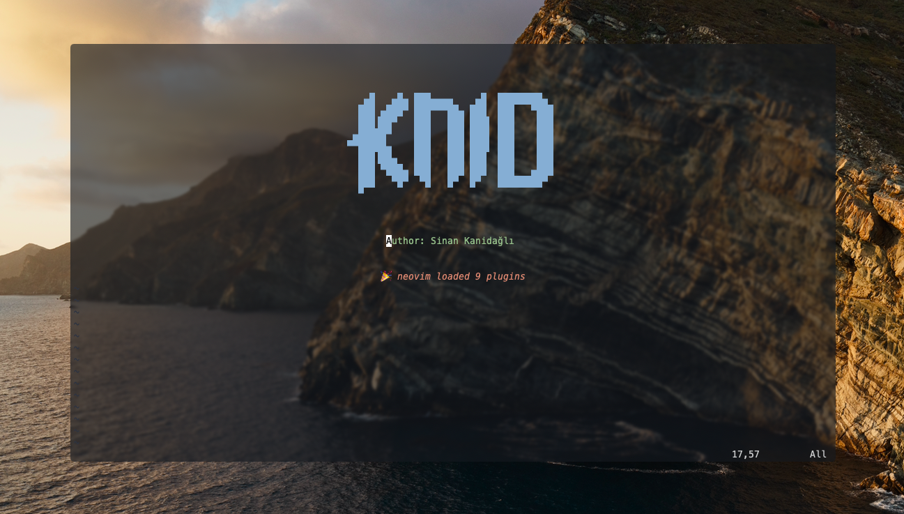
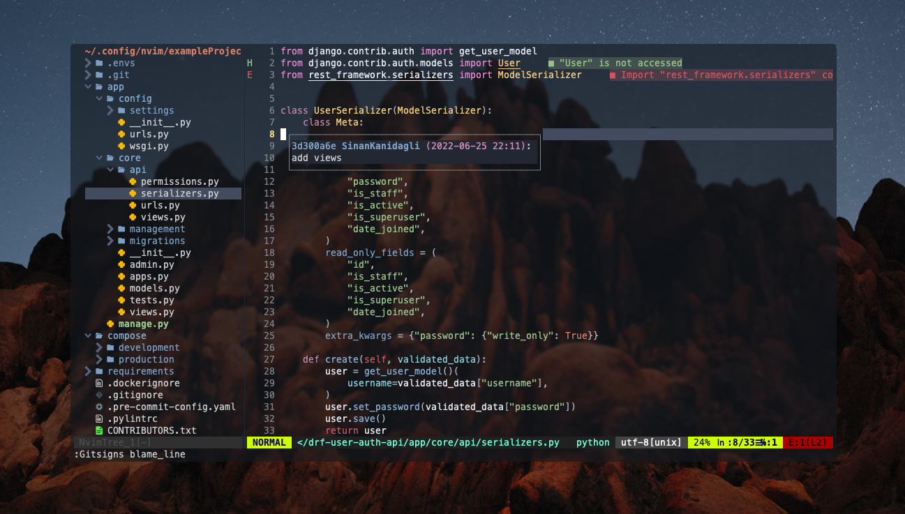
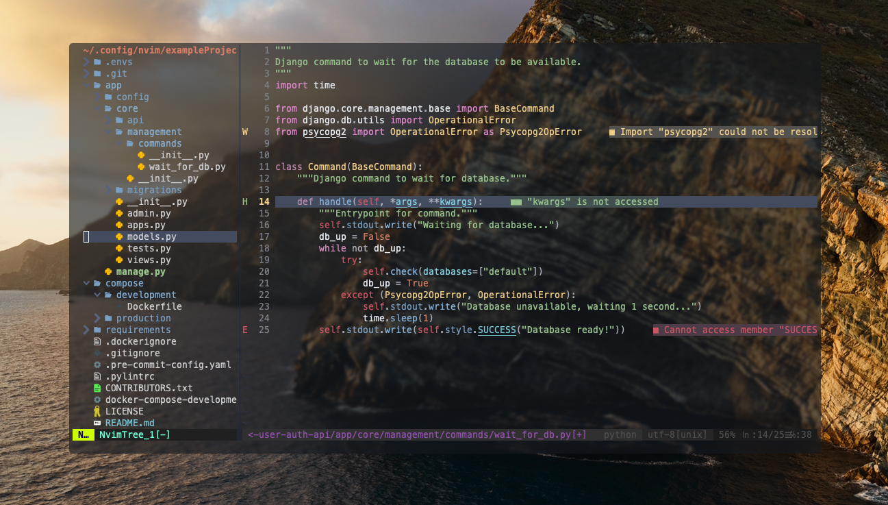

# My nvim conf files

Requires [Neovim](https://neovim.io/) (>= 0.8)

If you want to use transparent you have to make iterm2 transparent

## Try in docker

```bash
  docker run -w /root -it --rm alpine:edge sh -uelic '
    apk add git nodejs neovim ripgrep alpine-sdk --update
    git clone https://github.com/knid/nvim ~/.config/nvim && sh ~/.config/nvim/install.sh
    '
```

## Setup

```bash
git clone https://github.com/knid/nvim ~/.config/nvim && sh ~/.config/nvim/install.sh
```

## Config

if you want to disable transparent change **transparent variable** in **nvim/lua/knid/theme.lua**
